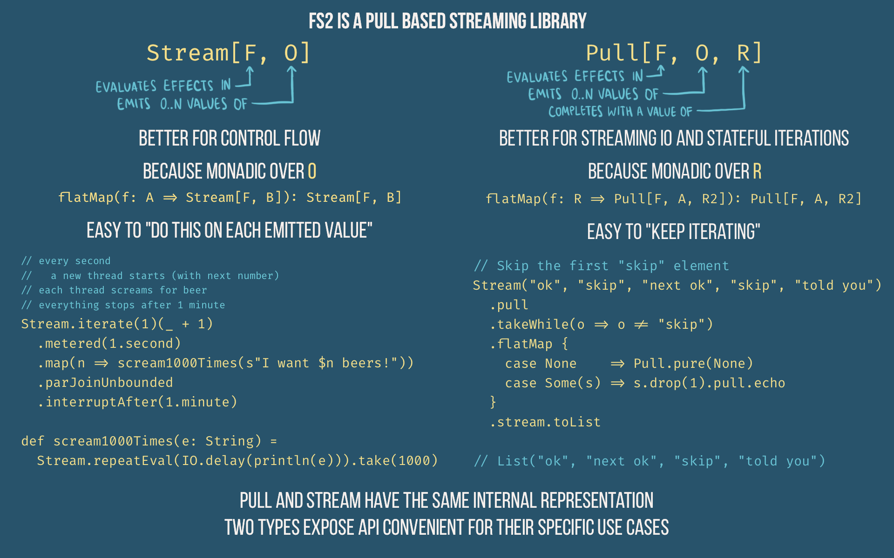

# Frequently Asked questions

### Why does stream evaluation sometimes hang in the REPL?

In versions of Scala between 2.12.0 and 2.13.1, stream programs that call `unsafeRunSync` or other blocking operations sometimes hang in the REPL. This is a result of Scala's lambda encoding and was tracked in [SI-9076](https://issues.scala-lang.org/browse/SI-9076). The issue was fixed in Scala 2.13.2 (see [scala/scala#8748](https://github.com/scala/scala/pull/8748)). If you are already using Scala 2.13.0 or 2.13.1, the easiest solution may be to upgrade to 2.13.2 or higher. If you cannot change Scala versions, there are various workarounds:
 - Add `-Ydelambdafy:inline` to REPL arguments
 - In Ammonite, run `interp.configureCompiler(_.settings.Ydelambdafy.tryToSetColon(List("inline")))`
 - In SBT, add `scalacOptions in console += "-Ydelambdafy:inline"` to `build.sbt`
 - Instead of calling `s.unsafeRunSync`, call `s.unsafeRunAsync(println)` or `Await.result(s.unsafeToFuture, timeout)`

### What does `Stream.compile` do?  Is it actually compiling something?  Optimizing the stream somehow?

\* _This question/answer adapted from this [Gitter thread](https://gitter.im/functional-streams-for-scala/fs2?at=5e962ebb6823cb38acd12ebd) with the bulk of the response coming from Fabio Labella._

At its core, `Stream[F, O].compile` is nothing more than a namespace for related methods that return the same type wrapper, `F`.  It's not compiling anything or doing any optimization.  For example, all the methods on `(s: Stream[IO, Int]).compile` generally have the return type `IO[Int]`.

In FP there is a technique of design through algebras (speaking here in the most general sense, even more general than tagless final) and it basically works like this:

* you have some type, for example `Option`
* some introduction forms (ways of getting "into" the algebra, e.g., `Option.empty`, `Option.some`; this is often referred to as "lifting" into a type)
* some combinators (building programs in your algebra from smaller programs, like `Option.map`, `Option.flatMap`, `Option.getOrElse`, etc)
* and potentially laws (e.g. `anyOption.flatMap(Option.empty) == Option.empty`)

Basically it's a way to write programs in a mini-language (in this case the `Option` language), which affords high compositionality through combinators that helps us write larger programs in a Lego way.

But what does it mean to "run" programs in Option?  "Running" an algebraic programs amounts to transforming the carrier type (`Option[A]`), into a different type (say `A`). The shape of this transformation depends on the shape of the language, and in the case of `Option`, it's basically `getOrElse` or `fold`.

This transformation function is called an eliminator. These functions transform your algebra type to another type, and correspond to our notion of "running".

Unsurprisingly, `Stream` also follows this pattern:

* `Stream` is the type
* `emit`, `eval` are the introduction forms (take types that aren't `Stream`, and convert them to `Stream`)
* `++`, `flatMap`, `concurrently` are combinators
* and lastly you have the elimination form, which begins with `compile`

For pure streams, we might convert them from `Stream[Pure, A]` -> `List[A]`.  For effectful streams, we transform them from `Stream[IO, A]` -> `IO[A]`.   The name compile is meant to evoke this translation process in which the `Stream` language gets compiled down to the `IO` language. It used to be called `run` in previous versions, but `compile` is more evocative of this transformation.

Note that this pattern is also used for `Stream.pull`

### What is the difference between Stream and Pull?



### Why are implicit instances of `Network`, `Files`, etc. only available for `IO`?

When you are writing tagless final code in a generic effect `F[_]`, it is good practice to explicitly declare the granular constraints that you actually need.

For example instead of:

```scala
def impl[F[_]: Async]: FooService[F] = ???
```

you should prefer:

```scala
def impl[F[_]: Concurrent: Network: Files]: FooService[F] = ???
```
